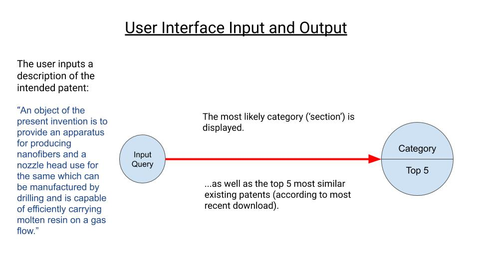
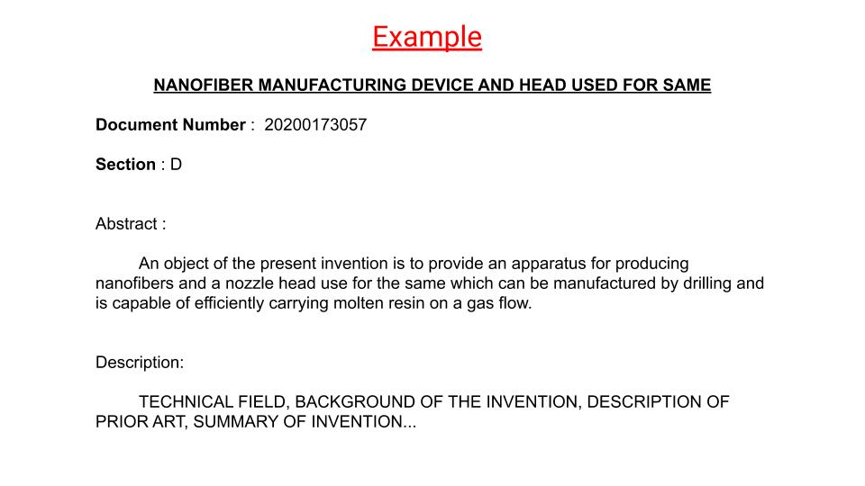
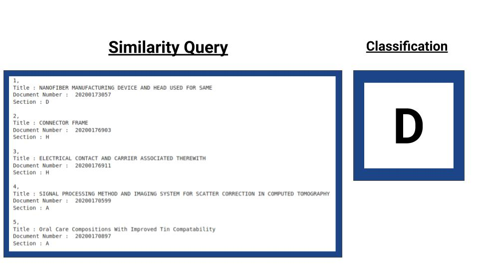

# Patent-Query
This project is a response to Capstone 3 for the Galvanize Data Science Intensive program. The scope of the project is to: 
1. return the top 5 most similar documents (in this case patents) from the most recent USPTO bulk patent download.
2. return the most likely catagorical section according to a patent description (abstract).

## Inspiration & Overview 
The United States Patent and Trademark Office (USPTO) is an institution that deals with an abundance of information. Therefore, it is a prime candidate to employ the tools of Data Science in creating ease of information interface and interpretability. Two primary obstacles to filing a new patent are determining whether or not that idea or patent already exists (known as prior art) and determining the initial category (section) under which to file. This project endeavors to serve the individual as well as companies in ease of filing. 

For the Individual:
- Everyone has at least one ‘million-dollar’ idea in their lives. The world is enriched when people are empowered to contribute their ingenuitive creations.  

For a company:
 - Patents are, in many ways, a glimpse into the future. New technologies, in addition to enhancing quality-of-life in society, have the disruptive potential to dramatically influence where, when, and how market resources are allocated. It is crucial for companies to be ahead of the curve in anticipating these changes. 

## Project Description

Simple input/output model: A description of the intended device (patent) is given. This description is cross-refenced with the database. The five most similiar descriptions and the most likely classification are returned. 

Once the USPTO xml file cache has been uploaded and processed, the patent abstracts and descriptions are conglomerated and the text is cleaned. Text vectorization must be separate for the document similarity and categorization features because document similarity must include the query while the categorization models must be trained without it. Multiple models were trained for the categorization feature in order to determine the most effective approach. A Stochastic Gradient Descent informed Linear Regression model was ultimately employed. 

## Example
### Input

This is a patent from the USPTO cache used (June 4, 2020). Note the title, section, and abstract.
### Output

These are the resuts of the query. 

 ## Procedure
 1. Download the most recent patent cache from the USPTO at https://developer.uspto.gov/
 
 1. Seperate individual XML files from USPTO caches by entering the following code in terminal:
 
 #csplit -f 'patent-' -b '%02d.xml' *{filepath}*.xml '/^<?xml /' '{*}'

1. Follow the guidelines in the code contained therein:
   1. Instantiate the dataframe
   1. preprocess text
   1. input search text (query)
   1. run categorization algorithm 

## References
Official patent categorization criteria can be found here: https://www.uspto.gov/web/patents/classification/cpc/html/cpc.html
